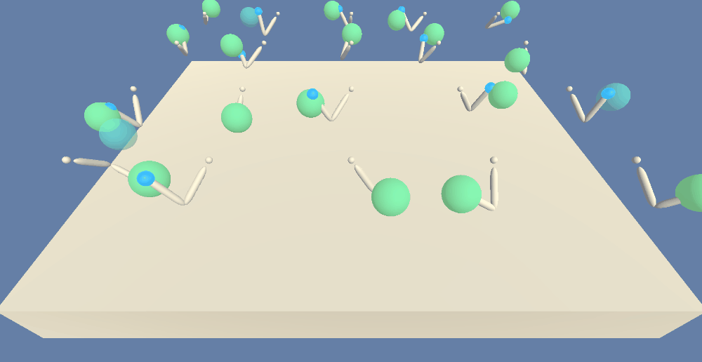
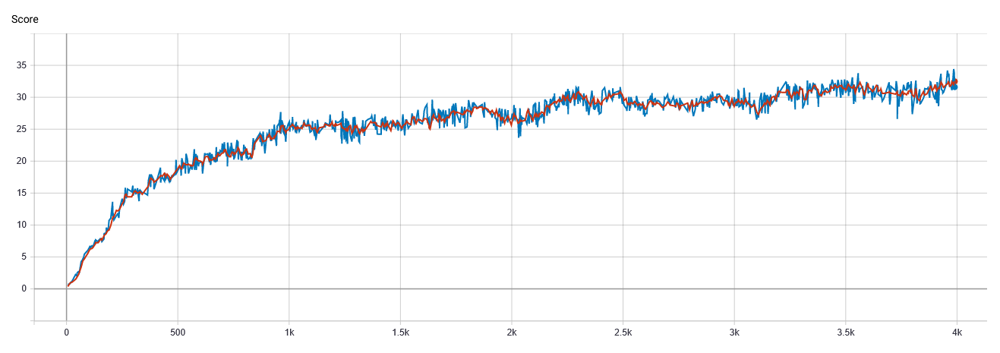

# Multi Agent PPO implementation for Unity environments
[This project is a Work in Progress]
## General info
The PPO implementation is written for multi agent environments with continuous action space.

The project has been done as part of a Udacity Deep Reinforcement Learning Nanodegree. It is adapted to fit Unity ML-Agents environments.
For more info check [Unity ML-Agents Toolkit](https://github.com/Unity-Technologies/ml-agents)

## Proximal Policy Optimization
The algorithm is based on the description provided in original [Proximal Policy Optimization paper](https://arxiv.org/abs/1707.06347) by OpenAI. However, to get a working version of algorithm, important code-level details were added from [The 32 Implementation Details of Proximal Policy Optimization (PPO) Algorithm](https://costa.sh/blog-the-32-implementation-details-of-ppo.html) and this [implementation](https://github.com/nikhilbarhate99/PPO-PyTorch). For more info check [Implementation details](#implementation-details)

## Additional Functionality
- Save GIFs from rendered episodes, the files are saved in `/images` directory (`render=True`) 
- Tensorboard logs for monitoring score and episode length (`tensorboard_logging=True`)
- Load pretrained model to evaluate or continue training (`pretrained=True`)

## Dependencies
All dependencies are provided in `requirements.txt` file.
The implementation uses Pytorch for training and Unity Environments for environments. The imageio is an optional dependency needed to save GIFs from rendered environment. 

## Example result for `Reacher` environment

 |  |
 | :---: |
| Agents trained after 4000 episodes | 

### Environment details
The state size consists of 33 real-valued numbers corresponding to position, rotation, velocity and angular velocity of each joint. The agent is controlled with 4 continuous actions corresponding to torque applied to two joints. The agent's goal is to maintain the end of the arm within the moving goal location. The agent is rewarded +0.1 for each step when the arm is within the spherical area marked with green. The environment ends after 1000 steps.

### Architecture modifications
The architecture size needs to be modified in order to achieve good results.

- Policy network:
 3 fully connected layers with 256 neurons each
- Actor network:
 3 fully connected layers with 256 neurons each

`tanh` activation is used for both networks

### Training progress

 |  |
 | :---: |
| Training progress of 20 agents in `Reacher` environment. Score averaged over 10 consecutive episodes (marked with red) | 

## Precompiled environments
Unity installation is needed to run and customize the environments, however it is possible to use the precompiled binaries for the particular environment. Download the version that fits your system and place it in the project's directory.

- Linux: [click here](https://s3-us-west-1.amazonaws.com/udacity-drlnd/P2/Reacher/Reacher_Linux.zip)
- Mac OSX: [click here](https://s3-us-west-1.amazonaws.com/udacity-drlnd/P2/Reacher/Reacher.app.zip)
- Windows (32-bit): [click here](https://s3-us-west-1.amazonaws.com/udacity-drlnd/P2/Reacher/Reacher_Windows_x86.zip)
- Windows (64-bit): [click here](https://s3-us-west-1.amazonaws.com/udacity-drlnd/P2/Reacher/Reacher_Windows_x86_64.zip)

## Implementation details

### Initialization
The last layer of policy network is initialized with weights rescaled by `0.01`. It is used to enforce more random choices in the beginning of the training and thus improving the training performance. It is one of the suggestions provided in [What Matters In On-Policy Reinforcement Learning? A Large-Scale Empirical Study](https://arxiv.org/abs/2006.05990)

The std value used for distribution to estimate actions is set to `0.5`.

### Advantage calculation

The advantage is calculated using normalized discounted rewards. The advantage values are computed during every iteration of policy update. 

### Loss calculation

The loss is a sum of these 3 components:
- Clipped Surrogate Objective from PPO paper with `epsilon value = 0.2`
- MSE Loss calculated from estimated state value and discounted reward (`0.5`)
- entropy of action distribution (`-0.01`)