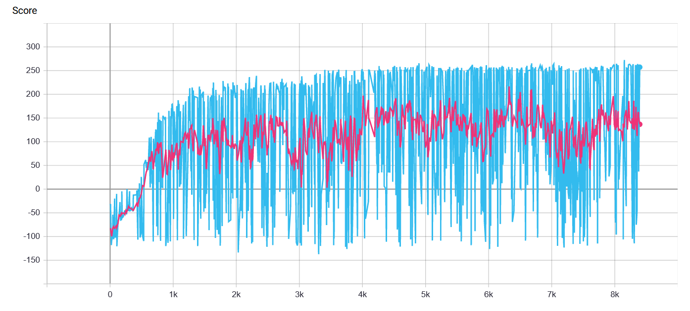

# Multi Agent PPO implementation for Unity environments

## General info
The implementation is written for multi agent environments with continuous action space.

The code has been written as an exercise while exploring Reinforcement Learning concepts. 
The algorithm is based on the description provided in original [Proximal Policy Optimization paper](https://arxiv.org/abs/1707.06347) by OpenAI. However, to get a working version of algorithm, important code-level details were added from [The 32 Implementation Details of Proximal Policy Optimization (PPO) Algorithm](https://costa.sh/blog-the-32-implementation-details-of-ppo.html) and this [implementation](https://github.com/nikhilbarhate99/PPO-PyTorch). For more info check [Implementation details](#implementation-details)

## Additional Functionality
- Save GIFs from rendered episodes, the files are saved in `/images` directory (`render=True`) 
- Tensorboard logs for monitoring score and episode length (`tensorboard_logging=True`)
- Load pretrained model to evaluate or continue training (`pretrained=True`)
## Dependencies
All dependencies are provided in `requirements.txt` file.
The implementation uses Pytorch for training and Gym for environments. The imageio is an optional dependency needed to save GIFs from rendered environment. 

## Example result
Training progress of an agent in `BipedalWalker-v3` environment.

 |  | 
:---: | :---: | :---:
500 episodes | 2000 episodes | 5000 episodes

 |  |
 | :---: |
| Training chart with score averaged over 20 consecutive episodes (marked with red) | 

## Implementation details

### Initialization
The last layer of policy network is initialized with weights rescaled by `0.01`. It is used to enforce more random choices in the beginning of the training and thus improving the training performance. It is one of the suggestions provided in [What Matters In On-Policy Reinforcement Learning? A Large-Scale Empirical Study](https://arxiv.org/abs/2006.05990)

The std value used for distribution to estimate actions is set to `0.5`.

### Advantage calculation

The advantage is calculated using normalized discounted rewards. The advantage values are computed during every iteration of policy update. 

### Loss calculation

The loss is a sum of these 3 components:
- Clipped Surrogate Objective from PPO paper with `epsilon value = 0.2`
- MSE Loss calculated from estimated state value and discounted reward (`0.5`)
- entropy of action distribution (`-0.01`)